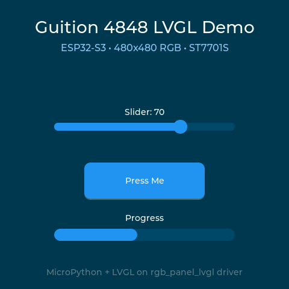

# guition-4848-micropython-lvgl

Example of Micropython & LVGL on the Guition 4848 available cheaply on Aliexpress.

Standalone example running LVGL on the Guition ESP32-S3-4848S040 board. No networking — just MicroPython + LVGL on a 480x480 RGB display.

## Hardware

- **Board:** Guition ESP32-S3-4848S040
- **Display:** 480x480 RGB565, ST7701S controller
- **SoC:** ESP32-S3 (dual-core, 240 MHz)
- **Flash:** 16 MB
- **PSRAM:** 8 MB (octal SPI, 80 MHz)
- **Interface:** CH340 USB-UART on UART0

## Prerequisites

- [ESP-IDF v5.2](https://docs.espressif.com/projects/esp-idf/en/v5.2/esp32s3/get-started/) installed
- Python 3.8+
- `pip install esptool mpremote`

## Build

Source ESP-IDF, then run the build script:

```bash
source ~/esp-idf/export.sh   # or wherever your ESP-IDF is
cd drivers
./build.sh
```

This clones MicroPython v1.24.1 and lv_binding_micropython, builds the cross-compiler, and compiles the firmware with LVGL + the RGB panel driver. Output goes to `firmware/firmware_guition_4848.bin`.

Options:
- `./build.sh --compile` — recompile only (skip cloning)
- `./build.sh --clean` — clean the build directory

## Flash

Connect the board via USB, then:

```bash
cd firmware
./flash.sh
```

This erases flash, writes the firmware, and uploads the Python application files. The board resets automatically.

Options:
- `./flash.sh --app-only` — re-upload `.py` files without reflashing firmware (fast iteration)
- `PORT=/dev/ttyACM0 ./flash.sh` — override serial port

## What you see



After flashing, the display shows an LVGL demo UI with a slider, button, and animated progress bar. No touch input is configured, so the demo runs in display-only mode.

## Project structure

```
drivers/
  build.sh                    Build script (clones deps, compiles firmware)
  lv_conf.h                   LVGL config (demo widgets enabled)
  rgb_panel_lvgl/             C driver: RGB panel + LVGL display registration
  boards/GUITION_4848/        MicroPython board definition

firmware/
  flash.sh                    Flash + upload script
  main.py                     Entry point: init display, build demo UI
  board.py                    Board config loader
  board_guition_4848.py       Pin mapping and display init
  panel_init_guition_4848.py  ST7701S init sequence (frozen into firmware)
  boot.py                     Boot stub
```

## Links

- [LVGL documentation](https://docs.lvgl.io/)
- [lv_binding_micropython](https://github.com/lvgl/lv_binding_micropython)
- [MicroPython](https://micropython.org/)
- [Guition ESP32-S3-4848S040 pinout](https://homeding.github.io/boards/esp32s3/panel-4848S040.htm)
